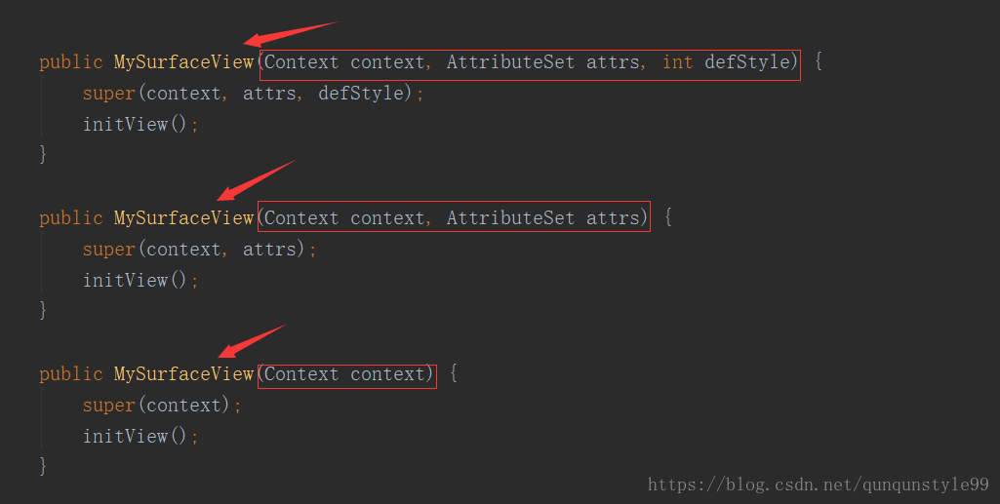
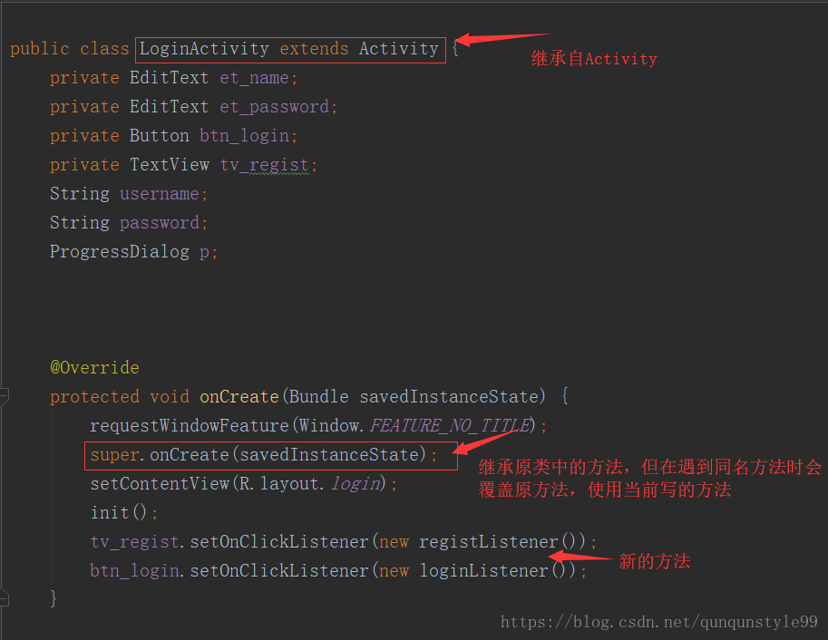
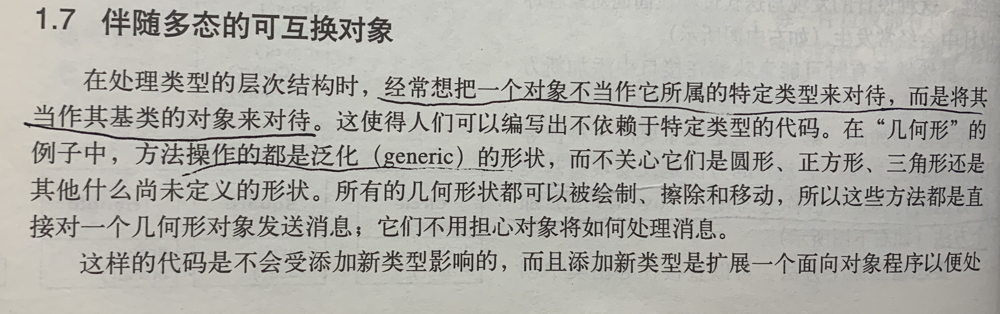

# Thinking in java(Fourth Edition)
    thinking in java notes
## Chapter 1: 对象导论
### 1.1 抽象过程
1.Object-oriented Programming,OOP 面向对象程序设计。  
2.所有的编程语言都提供抽象机制。  
3.汇编语言是对底层机器的轻微抽象，接着出现的许多'命令式'语言（如：FORTRAN,BASIC,C等）都是对汇编语言的抽
象。它们所作的主要抽象仍要求在解决问题时要基于计算机结构，而不是基于所要解决问题的结构来考虑。  
4.程序可以通过添加新类型的对象使自身适用于某个特定问题。   
5.Alan Key曾经总结了第一个成功的面向对象语言、同时也是Java所基于的语言之一的Smalltalk的五个基本特性，这些特性表现
了一种纯粹的面向对象程序设计方式。   
面向对象的五个特性：   
(1)万物皆为对象:将对象视为奇特的变量，它可以存储数据，除此之外，你还可以要求它在自身上执行操作。理论上讲，你可以抽取
带求解问题的任何概念化构件（狗，建筑，服务等），将其表示为程序中的对象；   
(2)程序是对象的集合，它们通过发送消息来告知彼此所要做的:要想请求一个对象，就必须对该对象发送一条消息，更具体的说，可
以把消息想像成为对某个特定对象的方法的调用请求；   
(3)每个对象都有自己的由其他对象所构成的存储:换句话说，可以通过创建包含现在对象的包的方式来创建新类型的对象,因此可以
在程序中构建复杂的体系，同时将其复杂性隐藏在对象的简单性背后；   
(4)每个对象都拥有类型:按照通用的说法，"`每个对象都是某个类（class）的一个实例（instance）`"，这里"类"就是"类型"的同
义词，每个类最重要的区别于其他类的特性就是"可以发送什么样的消息给它；   
(5)某一特定类型的所有对象都可以接收同样的消息：这是一句意味深长的表述，在你稍后便会看到，因为"圆形"类型的对象同时也
是"几何形"类型的对象，所以一个圆形对象必定能够接受发送给"几何形"对象的消息，这意味着可以编写与"几何形"交互并自动处理
所有与几何形性质相关的事物的代码，这种可替代性是oop中最强有力的概念之一。
----------------------------------------------------------------------------------------------------   
On Java 8:  
1.万物皆对象。你可以将对象想象成一种特殊的变量。它存储数据，但可以在你对其“发出请求”时执行本身的操作。理论上讲，你总  
是可以从要解决的问题身上抽象出概念性的组件，然后在程序中将其表示为一个对象。  
2.程序是一组对象，通过消息传递来告知彼此该做什么。要请求调用一个对象的方法，你需要向该对象发送消息。  
3.每个对象都有自己的存储空间，可容纳其他对象。或者说，通过封装现有对象，可制作出新型对象。所以，尽管对象的概念非常简
单，但在程序中却可达到任意高的复杂程度。  
4.每个对象都有一种类型。根据语法，每个对象都是某个“类”的一个“实例”。其中，“类”（Class）是“类型”（Type）的同义词。  
一个类最重要的特征就是“能将什么消息发给它？”。  
5.同一类所有对象都能接收相同的消息。这实际是别有含义的一种说法，大家不久便能理解。由于类型为“圆”（Circle）的一个对象  
也属于类型为“形状”（Shape）的一个对象，所以一个圆完全能接收发送给"形状”的消息。这意味着可让程序代码统一指挥“形状”，  
令其自动控制所有符合“形状”描述的对象，其中自然包括“圆”。这一特性称为对象的“可替换性”，是OOP最重要的概念之一。  
----------------------------------------------------------------------------------------------------
6.对象：`对象具有状态，行为和标识`。这意味着每一个对象都可以拥有内部数据（它们给出了该对象的状态）
和方法（它们产生的行为），每一个对象在内存中都有一个唯一的地址。   
#### 面向对象的七大设计原则:(https://blog.csdn.net/qq_34760445/article/details/82931002)  
开闭原则是面向对象的可复用设计的基石，其他设计原则是实现开闭原则的手段和工具，一般地，可以把这七个原则分成了以下两个
部分：   
设计目标：开闭原则、里氏代换原则、迪米特原则   
设计方法：单一职责原则、接口分隔原则、依赖倒置原则、组合/聚合复用原则     
###### 1)开闭原则（The Open-Closed Principle ，OCP）:(软件实体（模块，类，方法等）应该对扩展开放，对修改关闭。)   
a.概念：   
开闭原则是指在进行面向对象设计中，设计类或其他程序单位时，
应该遵循：对扩展开放（open）;对修改关闭（closed） 的设计原则。开闭原则是判断面向对象设计是否正确的最基本的原理之一。
根据开闭原则，在设计一个软件系统模块（类，方法）的时候，应该可以在不修改原有的模块（修改关闭）的基础上，能扩展其功能
（扩展开放）。扩展开放：某模块的功能是可扩展的，则该模块是扩展开放的。软件系统的功能上的可扩展性要求模块是扩展开放的。
修改关闭：某模块被其他模块调用，如果该模块的源代码不允许修改，则该模块修改关闭的。软件系统的功能上的稳定性，持续性要
求模块是修改关闭的。   
b.系统设计需要遵循开闭原则的原因:    
1)稳定性:开闭原则要求扩展功能不修改原来的代码，这可以让软件系统在变化中保持稳定; 
2)扩展性:开闭原则要求对扩展开放，通过扩展提供新的或改变原有的功能，让软件系统具有灵活的可扩展性。遵循开闭原则的系统
设计，可以让软件系统可复用，并且易于维护。   
c.开闭原则的实现方法:   
为了满足开闭原则的对修改关闭原则以及扩展开放原则，应该对软件系统中的不变的部分加以抽象，在面向对象的设计中，可以把这
些不变的部分加以抽象成不变的接口，这些不变的接口可以应对未来的扩展；接口的最小功能设计原则。根据这个原则，原有的接口
要么可以应对未来的扩展；不足的部分可以通过定义新的接口来实现；模块之间的调用通过抽象接口进行，这样即使实现层发生变化，
也无需修改调用方的代码。接口可以被复用，但接口的实现却不一定能被复用。接口是稳定的，关闭的，但接口的实现是可变的，开
放的。可以通过对接口的不同实现以及类的继承行为等为系统增加新的或改变系统原来的功能，实现软件系统的柔性扩展。好处：提
高系统的可复用性和可维护性。简单地说，软件系统是否有良好的接口（抽象）设计是判断软件系统是否满足开闭原则的一种重要的
判断基准。现在多把开闭原则等同于面向接口的软件设计。   
d.开闭原则的相对性:   
软件系统的构建是一个需要不断重构的过程，在这个过程中，模块的功能抽象，模块与模块间的关系，都不会从一开始就非常清晰明
了，所以构建100%满足开闭原则的软件系统是相当困难的，这就是开闭原则的相对性。但在设计过程中，通过对模块功能的抽象（接
口定义），模块之间的关系的抽象（通过接口调用），抽象与实现的分离（面向接口的程序设计）等，可以尽量接近满足开闭原则。   
###### 2)里氏替换原则（Liskov Substitution Principle ，LSP）:(所有引用基类的地方必须能透明地使用其派生类的对象。)   
a.概念：   
也就是说，只有满足以下2个条件的OO设计才可被认为是满足了LSP原则：不应该在代码中出现if/else之类对派生类类型进行判断的
条件。派生类应当可以替换基类并出现在基类能够出现的任何地方，或者说如果我们把代码中使用基类的地方用它的派生类所代替，
代码还能正常工作。里氏替换原则(LSP)是使代码符合开闭原则的一个重要保证。同时LSP体现了：类的继承原则：如果一个派生类的
对象可能会在基类出现的地方出现运行错误，则该派生类不应该从该基类继承，或者说，应该重新设计它们之间的关系。动作正确性
保证：从另一个侧面上保证了符合LSP设计原则的类的扩展不会给已有的系统引入新的错误。里式替换原则为我们是否应该使用继承
提供了判断的依据，不再是简单地根据两者之间是否有相同之处来说使用继承。里式替换原则的引申意义：子类可以扩展父类的功能，
但不能改变父类原有的功能。
具体来说：
子类可以实现父类的抽象方法，但不能覆盖父类的非抽象方法。
子类中可以增加自己特有的方法。
当子类的方法重载父类的方法时，方法的前置条件（即方法的输入/入参）要比父类方法的输入参数更宽松。
当子类的方法实现父类的方法时（重载/重写或实现抽象方法）的后置条件（即方法的输出/返回值）要比父类更严格或相等。
里式替换原则的优点
约束继承泛滥，是开闭原则的一种体现。
加强程序的健壮性，同时变更时也可以做到非常好地提高程序的维护性、扩展性。降低需求变更时引入的风险。
重构违反LSP的设计
如果两个具体的类A，B之间的关系违反了LSP 的设计，（假设是从B到A的继承关系），那么根据具体的情况可以在下面的两种重构方
案中选择一种：
创建一个新的抽象类C，作为两个具体类的基类，将A，B的共同行为移动到C中来解决问题。
从B到A的继承关系改为关联关系。
在进行设计的时候，我们尽量从抽象类继承，而不是从具体类继承。
如果从继承等级树来看，所有叶子节点应当是具体类，而所有的树枝节点应当是抽象类或者接口。当然这只是一个一般性的指导原则，
使用的时候还要具体情况具体分析。
在很多情况下，在设计初期我们类之间的关系不是很明确，LSP则给了我们一个判断和设计类之间关系的基准：需不需要继承，以及
怎样设计继承关系。   
----------------------------------------------------------------------------------------------------
On Java 8:  
对于继承可能会引发争论：继承应该只覆盖基类的方法(不应该添加基类中没有的方法)吗？如果这样的话，基类和派生类就是相同的  
类型了，因为它们具有相同的接口。这会造成，你可以用一个派生类对象完全替代基类对象，这叫作"纯粹替代"，也经常被称作"替代  
原则"。在某种意义上，这是一种处理继承的理想方式。我们经常把这种基类和派生类的关系称为是一个（is-a）关系，因为可以说  
"圆是一个形状"。判断是否继承，就看在你的类之间有无这种 is-a 关系。  
有时你在派生类添加了新的接口元素，从而扩展接口。虽然新类型仍然可以替代基类，但是这种替代不完美，原因在于基类无法访问  
新添加的方法。这种关系称为像是一个(is-like-a)关系。新类型不但拥有旧类型的接口，而且包含其他方法，所以不能说新旧类型  
完全相同
---------------------------------------------------------------------------------------------------- 
###### 3)迪米特原则（最少知道原则）（Law of Demeter ，LoD）：（迪米特原则（Law of Demeter）又叫最少知道原则（Least Knowledge Principle），可以简单说成：talk only to your immediate friends，只与你直接的朋友们通信，不要跟“陌生人”说话。）   
a.概念：   
对于面向OOD来说，又被解释为下面两种方式：
1）一个软件实体应当尽可能少地与其他实体发生相互作用。
2）每一个软件单位对其他的单位都只有最少的知识，而且局限于那些与本单位密切相关的软件单位。
朋友圈的确定“朋友”条件：
当前对象本身（this）
以参量形式传入到当前对象方法中的对象
当前对象的实例变量直接引用的对象
当前对象的实例变量如果是一个聚集，那么聚集中的元素也都是朋友
当前对象所创建的对象
任何一个对象，如果满足上面的条件之一，就是当前对象的“朋友”，否则就是“陌生人”。   
b.迪米特原则的优缺点   
迪米特原则的初衷在于降低类之间的耦合。由于每个类尽量减少对其他类的依赖，因此，很容易使得系统的功能模块功能独立，相互
之间不存在（或很少有）依赖关系。迪米特原则不希望类直接建立直接的接触。如果真的有需要建立联系，也希望能通过它的友元类
来转达。因此，应用迪米特原则有可能造成的一个后果就是：系统中存在大量的中介类，这些类之所以存在完全是为了传递类之间的
相互调用关系，这在一定程度上增加了系统的复杂度。例如，购房者要购买楼盘A、B、C中的楼，他不必直接到楼盘去买楼，而是可以
通过一个售楼处去了解情况，这样就减少了购房者与楼盘之间的耦合。   
c.使用迪米特原则时要考虑的   
朋友间也是有距离的. 一个类公开的public属性或方法越多，修改时涉及的面也就越大，变更引起的风险扩散也就越大。因此，为了
保持朋友类间的距离，在设计时需要反复衡量：是否还可以再减少public方法和属性，是否可以修改为private等。注意： 迪米特
原则要求类“羞涩”一点，尽量不要对外公布太多的public方法和非静态的public变量，尽量内敛，多使用private、protected等
访问权限。是自己的就是自己的。如果一个方法放在本类中，既不增加类间关系，也对本类不产生负面影响，就放置在本类中。   
###### 4)单一职责原则：（永远不要让一个类存在多个改变的理由。）   
a.概念   
换句话说，如果一个类需要改变，改变它的理由永远只有一个。如果存在多个改变它的理由，就需要重新设计该类。单一职责原则原
则的核心含意是：只能让一个类/接口/方法有且仅有一个职责。
b.为什么一个类不能有多于一个以上的职责？   
如果一个类具有一个以上的职责，那么就会有多个不同的原因引起该类变化，而这种变化将影响到该类不同职责的使用者（不同用户）：
一方面，如果一个职责使用了外部类库，则使用另外一个职责的用户却也不得不包含这个未被使用的外部类库。另一方面，某个用户
由于某个原因需要修改其中一个职责，另外一个职责的用户也将受到影响，他将不得不重新编译和配置。这违反了设计的开闭原则，
也不是我们所期望的。   
c.职责的划分   
既然一个类不能有多个职责，那么怎么划分职责呢？Robert.C Martin给出了一个著名的定义：所谓一个类的一个职责是指引起该类
变化的一个原因。如果你能想到一个类存在多个使其改变的原因，那么这个类就存在多个职责。   
d.使用单一职责原则的理由   
单一职责原则从职责（改变理由）的侧面上为我们对类（接口）的抽象的颗粒度建立了判断基准：在为系统设计类（接口）的时候应
该保证它们的单一职责性。降低了类的复杂度、提高类的可读性，提高系统的可维护性、降低变更引起的风险
###### 5)接口分隔原则（Interface Segregation Principle ，ISP）:(不能强迫用户去依赖那些他们不使用的接口。)   
a.概念   
换句话说，使用多个专门的接口比使用单一的总接口总要好。它包含了2层意思：
接口的设计原则：接口的设计应该遵循最小接口原则，不要把用户不使用的方法塞进同一个接口里。如果一个接口的方法没有被使用
到，则说明该接口过胖，应该将其分割成几个功能专一的接口。
接口的依赖（继承）原则：如果一个接口a继承另一个接口b，则接口a相当于继承了接口b的方法，那么继承了接口b后的接口a也应该
遵循上述原则：不应该包含用户不使用的方法。 反之，则说明接口a被b给污染了，应该重新设计它们的关系。
如果用户被迫依赖他们不使用的接口，当接口发生改变时，他们也不得不跟着改变。换而言之，一个用户依赖了未使用但被其他用户
使用的接口，当其他用户修改该接口时，依赖该接口的所有用户都将受到影响。这显然违反了开闭原则，也不是我们所期望的。
总而言之，接口分隔原则指导我们：一个类对一个类的依赖应该建立在最小的接口上；建立单一接口，不要建立庞大臃肿的接口；尽
量细化接口，接口中的方法尽量少   
b.接口分隔原则的优点和适度原则  
接口分隔原则从对接口的使用上为我们对接口抽象的颗粒度建立了判断基准：在为系统设计接口的时候，使用多个专门的接口代替单一
的胖接口。符合高内聚低耦合的设计思想，从而使得类具有很好的可读性、可扩展性和可维护性。注意适度原则，接口分隔要适度，
避免产生大量的细小接口。   
c.单一职责原则和接口分隔原则的区别   
单一职责强调的是接口、类、方法的职责是单一的，强调职责，方法可以多，针对程序中实现的细节；接口分隔原则主要是约束接口，
针对抽象、整体框架。   
###### 6)依赖倒置原则（Dependency Inversion Principle ，DIP）:(A. 高层模块不应该依赖于低层模块，二者都应该依赖于抽象 
B. 抽象不应该依赖于细节，细节应该依赖于抽象 C.针对接口编程，不要针对实现编程。)   
a.概念   
依赖：在程序设计中，如果一个模块a使用/调用了另一个模块b，我们称模块a依赖模块b。
高层模块与低层模块：往往在一个应用程序中，我们有一些低层次的类，这些类实现了一些基本的或初级的操作，我们称之为低层模
块；另外有一些高层次的类，这些类封装了某些复杂的逻辑，并且依赖于低层次的类，这些类我们称之为高层模块。
依赖倒置（Dependency Inversion）：面向对象程序设计相对于面向过程（结构化）程序设计而言，依赖关系被倒置了。因为传统
的结构化程序设计中，高层模块总是依赖于低层模块。
问题的提出：
Robert C. Martin氏在原文中给出了“Bad Design”的定义：
系统很难改变，因为每个改变都会影响其他很多部分。
当你对某地方做一修改，系统的看似无关的其他部分都不工作了。
系统很难被另外一个应用重用，因为很难将要重用的部分从系统中分离开来。
导致“Bad Design”的很大原因是“高层模块”过分依赖“低层模块”。
一个良好的设计应该是系统的每一部分都是可替换的。如果“高层模块”过分依赖“低层模块”，一方面一旦“低层模块”需要替换或者修
改，“高层模块”将受到影响；另一方面，高层模块很难可以重用。
问题的解决：
为了解决上述问题，Robert C. Martin氏提出了OO设计的Dependency Inversion Principle (DIP) 原则。
DIP给出了一个解决方案：在高层模块与低层模块之间，引入一个抽象接口层。
抽象接口是对低层模块的抽象，低层模块继承或实现该抽象接口。
这样，高层模块不直接依赖低层模块，而是依赖抽象接口层。抽象接口也不依赖低层模块的实现细节，而是低层模块依赖（继承或实
现）抽象接口。
类与类之间都通过抽象接口层来建立关系。   
b.依赖倒置原则的违反例和重构   
c.怎么使用依赖倒置原则
1）依赖于抽象
任何变量都不应该持有一个指向具体类的指针或引用; 任何类都不应该从具体类派生。
2）设计接口而非设计实现
使用继承避免对类的直接绑定。抽象类/接口： 倾向于较少的变化；抽象是关键点，它易于修改和扩展；不要强制修改那些抽象接口
/类。例外：有些类不可能变化，在可以直接使用具体类的情况下，不需要插入抽象层，如：字符串类
3）避免传递依赖
避免高层依赖于低层;使用继承和抽象类来有效地消除传递依赖   
d.依赖倒置原则的优点   
可以减少类间的耦合性、提高系统稳定性，提高代码可读性和可维护性，可降低修改程序所造成的风险。
###### 7)组合/聚合复用原则（Composite/Aggregate Reuse Principle ，CARP）:(尽量使用组合/聚合，不要使用类继承。)   
a.概念   
即在一个新的对象里面使用一些已有的对象，使之成为新对象的一部分，新对象通过向这些对象的委派达到复用已有功能的目的。就
是说要尽量的使用合成和聚合，而不是继承关系达到复用的目的。组合和聚合都是关联的特殊种类。聚合表示整体和部分的关系，表
示“拥有”。组合则是一种更强的“拥有”，部分和整体的生命周期一样。组合的新的对象完全支配其组成部分，包括它们的创建和湮灭
等。一个组合关系的成分对象是不能与另一个组合关系共享的。组合是值的聚合（Aggregation by Value），而一般说的聚合是引
用的聚合（Aggregation by Reference）。在面向对象设计中，有两种基本的办法可以实现复用：第一种是通过组合/聚合，第二
种就是通过继承。   
b.什么时候才应该使用继承   
只有当以下的条件全部被满足时，才应当使用继承关系：
1）派生类是基类的一个特殊种类，而不是基类的一个角色，也就是区分"Has-A"和"Is-A"。只有"Is-A"关系才符合继承关系，
"Has-A"关系应当用聚合来描述。
2）永远不会出现需要将派生类换成另外一个类的派生类的情况。如果不能肯定将来是否会变成另外一个派生类的话，就不要使用继承。
3）派生类具有扩展基类的责任，而不是具有置换掉（override）或注销掉（Nullify）基类的责任。如果一个派生类需要大量的置
换掉基类的行为，那么这个类就不应该是这个基类的派生类。
4）只有在分类学角度上有意义时，才可以使用继承。   
总的来说：如果语义上存在着明确的"Is-A"关系，并且这种关系是稳定的、不变的，则考虑使用继承；如果没有"Is-A"关系，或者
这种关系是可变的，使用组合。另外一个就是只有两个类满足里氏替换原则的时候，才可能是"Is-A" 关系。也就是说，如果两个类
是"Has-A"关系，但是设计成了继承，那么肯定违反里氏替换原则。错误的使用继承而不是组合/聚合的一个常见原因是错误的把
"Has-A"当成了"Is-A" 。"Is-A"代表一个类是另外一个类的一种；"Has-A"代表一个类是另外一个类的一个角色，而不是另外一个
类的特殊种类。   
看一个例子：如果我们把“人”当成一个类，然后把“雇员”，“经理”，“学生”当成是“人”的派生类。这个的错误在于把 “角色” 的等
级结构和 “人” 的等级结构混淆了。“经理”，“雇员”，“学生”是一个人的角色，一个人可以同时拥有上述角色。如果按继承来设计，
那么如果一个人是雇员的话，就不可能是学生，这显然不合理。正确的设计是有个抽象类 “角色”，“人”可以拥有多个“角色”（聚合），
“雇员”，“经理”，“学生”是“角色”的派生类。   
c.通过组合/聚合复用的优缺点   
优点：
1.新对象存取子对象的唯一方法是通过子对象的接口。
2.这种复用是黑箱复用，因为子对象的内部细节是新对象所看不见的。
3.这种复用更好地支持封装性。
4.这种复用实现上的相互依赖性比较小。
5.每一个新的类可以将焦点集中在一个任务上。
6.这种复用可以在运行时间内动态进行，新对象可以动态的引用与子对象类型相同的对象。
7.作为复用手段可以应用到几乎任何环境中去。
缺点: 就是系统中会有较多的对象需要管理。   
d.通过继承来进行复用的优缺点   
优点：新的实现较为容易，因为基类的大部分功能可以通过继承的关系自动进入派生类。修改和扩展继承而来的实现较为容易。
缺点：继承复用破坏封装性，因为继承将基类的实现细节暴露给派生类。由于基类的内部细节常常是对于派生类透明的，所以这种复
用是透明的复用，又称“白箱”复用。如果基类发生改变，那么派生类的实现也不得不发生改变。从基类继承而来的实现是静态的，不
可能在运行时间内发生改变，没有足够的灵活性。

#### 另一篇关于面向对象设计原则的文章(https://blog.csdn.net/hustzw07/article/details/80599839)
可维护性：Robert C.Martin认为一个可维护性较低的软件设计，通常由于如下四个原因造成：   
• 过于僵硬(Rigidity)   
• 过于脆弱(Fragility)   
• 复用率低(Immobility)   
• 黏度过高(Viscosity)    
可复用性：Peter Coad认为，一个好的系统设计应该具备如下三个性质：   
• 可扩展性(Extensibility)   
• 灵活性(Flexibility)   
• 可插入性(Pluggability)    
###### 1)单一职责原则
所谓职责，即“变化的原因”。如果你能够想到多于一个的动机去改变一个类，那么这个类就具有多于一个的职责。就要拆分这个类。
而拆分后的类内聚性提高。相信你也看到了，类的拆分会导致产生大量短小的类。不过软件开发中有个说法：系统应该由许多短小的
类而不是少量巨大的类组成。因此，个人觉得这不是个缺点
###### 2)开闭原则
该原则要求，软件实现应该对扩展开放，对修改关闭。意思就是说一个软件实体应该通过扩展来实现变化，而不是通过修改已有的代
码来实现变化的。实现开闭原则的关键就是“抽象”。把可能的行为抽象成一个抽象层。之后的扩展都是对这个抽象的实现。
###### 3)里氏代换原则
里氏代换原则是对开闭原则的补充，它讲的是基类和子类的关系。
“鸵鸟不是鸟"，”正方形是长方形"都是理解里氏代换原则的最经典的例子。小学数学的时候就知道，正方形是长方形，即一个长宽相
等的长方形。由此，应该让正方形继承自长方形。
###### 4)依赖倒转原则
所谓依赖倒转（Dependency Inversion Principle）有两条：A.高层次的模块不应该依赖于低层次的模块，他们都应该依赖于抽
象。B.抽象不应该依赖于具体实现，具体实现应该依赖于抽象。

###### 5)接口隔离原则
客户端不应该依赖它不需要的接口；一个类对另一个类的依赖应该建立在最小的接口上。
###### 6)合成复用原则
这个原则很简单：多用组合，少用继承。我们知道，继承是面向对象三大特征之一：封装、继承和多态。而且继承实现简单，易于扩
展。不过继承是有缺陷的：1.父类变，子类就必须变。2.继承破坏了封装，对父类而言，它的实现细节对子类来说都是透明的。3.继
承是一种强耦合关系。   
对于子类来说，父类方法的细节是透明的，也就是不可见的。子类不知道里面的内容，但是当父类修改了自己的方法时，子类方法就
会受影响发生变化。子类方法本来是封装的，但是父类的改变了这点。即父类破坏了子类的封装。   
总结下来：
1.对于子类而言，通过继承实现是没有安全保障的。因为父类修改的内部实现细节，子类的功能就可能被破坏。
2.对于父类而言，有子类继承和重写它的方法时，父类的方法就不能任意修改。
###### 7)迪米特法则
即最少知道原则。在《代码整洁之道》中翻译为得墨忒耳法则。设计模式中的外观模式（Facade）和中介模式（Mediator），都是
迪米特法则应用的例子。得墨忒耳法则认为，类C的方法f 只应该调用以下对象的方法：
1. C
2. 由f创建的对象
3. 作为参数传递给f的对象
4. 由C的实体遍历持有的对象
-----
1. 在类的划分上，应该创建有弱耦合的类
2. 在类的结构设计上，每一个类都应当尽量降低成员的访问权限
3. 在类的设计上，只要有可能，一个类应当设计成不变类
4. 在对其他类的引用上，一个对象对其它对象的引用应当降到最低
5. 尽量降低类的访问权限
6. 不要暴露类成员，而应该提供相应的访问器   
缺点：迪米特法则有个缺点：系统中会产生大量的小方法。
### 1.2 每个对象都有一个接口
1.`类描述了具有相同特性（数据元素）和行为（功能）的对象集合，所以一个类实际上就是一个数据类型(So what is class?)`，
例如：所有浮点型数字具有相同的特性和行为集合。   
2.编程系统欣然接受新的类，并且像对待内置类一样照管它们和进行类型检查。   
3.Light lt = new Light(); lt.on();     
类型名称:Light；接口:on(),off(),brighten(),dim()。接口确定了对某一特定对象所能发出的请求。   
过程概括为:向某个对象"发送请求"（产生请求），这个对象便知道此消息的目的，然后执行对应的程序代码，   
类型/类的名称是Light，特定的Light对象的名称是lt，可以向Light对象发出的请求时：打开它，关闭它，将它调亮，将它调暗。   
你以下列方式创建了一个Light对象：定义这个对象的"引用"（lt），然后调用new方法来创建该类型的新对象。   
### 1.3 每个对象都提供服务
1.高内聚是软件设计的基本质量要求之一：这意味着一个软件构件（例如一个对象，当然它也有可能是指一个方法或者一个对象库）的各个方面"组合"得很好   
### 1.4 被隐藏的具体实现
1.将程序开发人员按照角色分为类创建者（那些创建新数据类型的程序员）和客户端程序员（那些在其应用中使用数据类型的类消费者）是大有裨益的。   
2.访问控制的第一个存在原因：   
让客户端程序员无法触及他们不应该触及的部分；   
允许库设计者可以该改变类内部的工作方式而不用担心会影响到客户端程序员。
3.java访问控制权限：public,private,protected,default.   
public:表示紧随其后的元素对任何人都是可用的；
private:除类型创建者和类型的内部方法之外的任何人都不能访问的元素；
protected:与private作用相当，差别仅在于继承的类可以访问protected成员，但是不能访问private成员；
default:默认的访问权限，这种权限通常被称为包访问权限，因为在这种权限下，类可以访问在同一个包（库构件）中的其他类的成员。
### 1.5 复用具体实现
1.最简单地复用某个类的方式就是直接使用该类的一个对象，此外也可以将那个类的一个对象置于某个新的类中，我们称其为"创建一个成员对象"，新的类可以由
任意数量，任意类型的其他对象以任意可以实现新的类中想要的功能的方式所组成，因为是在使用现有的类合成新的类，所以这种概念被称为组合（composition），
如果组合是动态发生的，那么它通常被称为聚合（aggregation）。
### 1.6 继承
1.`所有可以发送给基类对象的消息同时也可以发送给导出类对象`。   
2.`导出类与基类具有相同的类型`。   
3.有两种方式可以使基类与导出类产生差异：   
(1)直接在导出类中添加新方法；   
(2)改变现有基类的方法的行为，这被称之为覆盖（overriding）那个方法。
#### Override and Overload(https://blog.csdn.net/qunqunstyle99/article/details/81007712)
1.Overload:   
重载（Overload）是让类以统一的方式处理不同类型数据的一种手段，实质表现就是多个具有不同的参数个数或者类型的同名函数
（返回值类型可随意，不能以返回类型作为重载函数的区分标准）同时存在于同一个类中，是一个类中多态性的一种表现（调用方法
时通过传递不同参数个数和参数类型来决定具体使用哪个方法的多态性）。

1.Override:   
重写（Override）是父类与子类之间的多态性，实质是对父类的函数进行重新定义，如果在子类中定义某方法与其父类有相同的名称
和参数则该方法被重写，不过子类函数的访问修饰权限不能小于父类的；若子类中的方法与父类中的某一方法具有相同的方法名、返
回类型和参数表，则新方法将覆盖原有的方法，如需父类中原有的方法则可使用 super 关键字。

重载规则：必须具有不同的参数列表；可以有不同的返回类型；可以有不同的访问修饰符；可以抛出不同的异常。
重写规则：参数列表必须完全与被重写的方法相同，否则不能称其为重写；返回类型必须一直与被重写的方法相同，否则不能称其为
重写；访问修饰符的限制一定要大于等于被重写方法的访问修饰符；重写方法一定不能抛出新的检查异常或者比被重写方法申明更加
宽泛的检查型异常，譬如父类方法声明了一个检查异常 IOException，在重写这个方法时就不能抛出 Exception，只能抛出 
IOException 的子类异常，可以抛出非检查异常。   

重载与重写是 Java 多态性的不同表现。
重写是父类与子类之间多态性的表现，在运行时起作用（动态多态性，譬如实现动态绑定）
而重载是一个类中多态性的表现，在编译时起作用（静态多态性，譬如实现静态绑定）

问：Java 构造方法能否被重写和重载？   
答：重写是子类方法重写父类的方法，重写的方法名不变，而类的构造方法名必须与类名一致，假设父类的构造方法如果能够被子类
重写则子类类名必须与父类类名一致才行，所以Java的构造方法是不能被重写的。而重载是针对同一个的，所以构造方法可以被重
载（子类不能调用，重写父类的构造器）。

问：下面程序的运行结果是什么，为什么？
```java
public class Demo {
   
public boolean equals( Demo other) {
        System.out.println("use Demo equals." );
        return true;    
}
    
public static void main(String[] args) {    
    Object o1 =new Demo ();
    Object o2 =new Demo ();        
    Demo o3 =new Demo ();
    Demo o4 =new Demo ();

   if (o1.equals(o2)) {
            System.out.println("o1 is equal with o2.");
        }

   if(o3.equals(o4)) {             
            System.out.println("o3 is equal with o4.");
        }
    }
}
```
答：上面程序的运行结果如下。
```
use Demo equals.
o3 is equal with o4.
```
因为 Demo 类中的 public boolean equals(Demo other) 方法并没有重写 Object 类中的 public boolean equals(Object obj) 
方法，原因是其违背了参数规则，其中一个是 Demo 类型而另一个是 Object 类型，因此这两个方法是重载关系（发生在编译时）
而不是重写关系；故当调用 o1.equals(o2) 时，o2 是 Object 类型参数，实际上调用了 Object 类中的 public boolean equals(Object obj) 
方法，因为在编译时 o1 和 o2 都是 Object 类型，而Object 类的 equals 方法是通过比较内存地址才返回 false；当调用 
o3.equals(o4) 时，实际上调用了 Demo 类中的 equals(Demo other) 方法，因为在编译时 o3 和 o4 都是 Demo 类型的，
所以才有上面的打印。
### 1.7 伴随多态的可互换对象

----------------------------------------------------------------------------------------------------   
On Java 8:  
发送消息给对象时，如果程序不知道接收的具体类型是什么，但最终执行是正确的，这就是对象的“多态性”（Polymorphism）。面  
向对象的程序设计语言是通过“动态绑定”的方式来实现对象的多态性的。编译器和运行时系统会负责对所有细节的控制；我们只需知  
道要做什么，以及如何利用多态性来更好地设计程序。  
----------------------------------------------------------------------------------------------------  
1.把一个对象不当做它所属的特定类型来对待，而是将其当作其基类的对象来对待。   
2.一个非面向对象编程的编译器产生的函数调用会引起所谓的前期绑定，编译器产生对一个具体函数名字的调用，而运行时将这个调用解析到将要被执行的代码的绝对地址。   
3.面向对象程序设计语言使用了后期绑定的概念，程序直到运行时才能确定代码的地址。C++必须使用virtual关键字实现后期绑定，
而java，动态绑定是默认的，不需要添加额外的关键字来实现多态。  
4.--
```
void doSomething(Shape shape){   
    shape.erase();   
    // ...  
    shape.draw();   
}

Circle circle = new Circle();   
Triangle triangle = new Triangle();   
Line line = new Line();   
doSomething(circle);   
doSomething(triangle);   
doSomething(line); 
```  
当Circle被传入到预期接收Shape的方法中，由于Circle可以被doSomething()看作是Shape也就是说，doSomething()
可以发送给Shape的任何消息，Circle都可以接收。    
5.把将导出类看做是它的基类的过程称为向上转型（upcasting）。转型（cast）这个名称的灵感来自于模型铸造的塑膜动作；
而向上（up）这个词来源于继承图的经典布局方式，通常基类在顶部，而导出类在其下部散开，因此，转型为一个基类就是在继承图
中向上移动，即向上转型。 



### 1.8 单根继承结构
1.java中所有的类最终都继承自单一的基类Object。   
2.单根继承结构保证所有对象都具备某些功能。   
3.单根继承结构使垃圾回收器的实现变得容易得多，由于所有对象都保证具有其基类型信息，因此不会因无法确定对象的类型而陷入僵局。
### 1.9 容器
1.被称为容器的新对象，在任何需要时都可以扩充自己以容纳你置于其中的所有东西。   
2.书中所说的容器指的就是：List(用于存储序列),Map(也被称为关联数组，用来创建对象之间的关联),Set(每种对象类型只持有一个),以及诸如队列，
树，堆栈等更多的构件。   
3.需要对容器有所选择：   
(1)不同容器提供了不同类型的接口和外部行为。
(2)不同的容器对于某些操作具有不同的效率。ArrayList与LinkedList，在ArrayList中，随机访问一个元素是一个花费固定时间的
操作，但是对于LinkedList来说，随机选取元素需要在列表中移动，这种代价是高昂的，访问越靠近表尾的元素，花费时间越长。另一方面，
如果想在序列中间插入一个元素，LinkedList的开销却比ArrayList要小。   
4.Java SE5出现之前，容器存储的对象都只具有Java中的通用类型：Object，单根继承结构意味着所有的东西都是Object类型，所以可以存储
Object的容器可以存储任何东西。当对象置入Object容器，会丢失当前身份，取出，得到的是Object对象引用而不是之前对象的引用，因此需要
向下转型，但是向下转型不安全，所以出现了参数化类型机制，通过参数化类型，编译器可以定制一个只接纳和取出Shape对象的容器，Java SE5
的重大变化之一就是参数化类型，在Java中叫范型，一对尖括号，中间包含类型信息 ArrayList<Shape> shapes = new ArrayList<Shape>();
5.向上转型是安全的，例如：Circle是一种Shape类型，但是不知道某个Object是Circle还是Shape，所以除非确切知道所要处理的对象类型，否则
向下转型是不安全的。
### 1.10 对象的创建和生命周期
1.所有对象都是继承子单根基类Object，只能以一种方式创建对象（在堆上创建）。   
2.C++对象的创建是在堆栈上，速度极快，只需要一条汇编指令，Java是在堆的内存池中动态创建对象的，速度比堆栈慢（在堆上创
建对象，编译器无法知道它的生命周期，只能运行时确定）。   
### 1.11 异常处理：处理错误
1.异常是一种对象，它从出错地点被"抛出"，并被专门设计用来处理特定类型错误的相应的异常处理器"捕获"。
### 1.12 并发编程
1.并发：在同一时刻处理多个任务。   
2.java的并发是内置于语言中的。
### 1.13 Java与Internet
1.系统具有一个中央信息存储池，用来存储某种数据，它通常存在于数据库中，你可以根据需要将它分发给某些人员或者机器集群。
2.信息存储池，用于分发信息的软件以及信息与软件所驻留的机器或者机群被总称为服务器。

----------
后续笔记在每个模块中的README......
